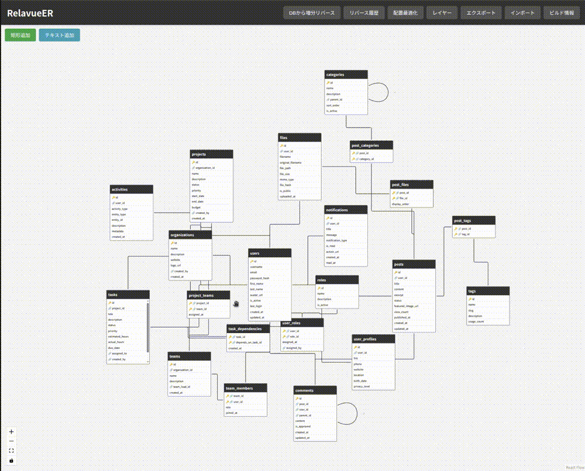
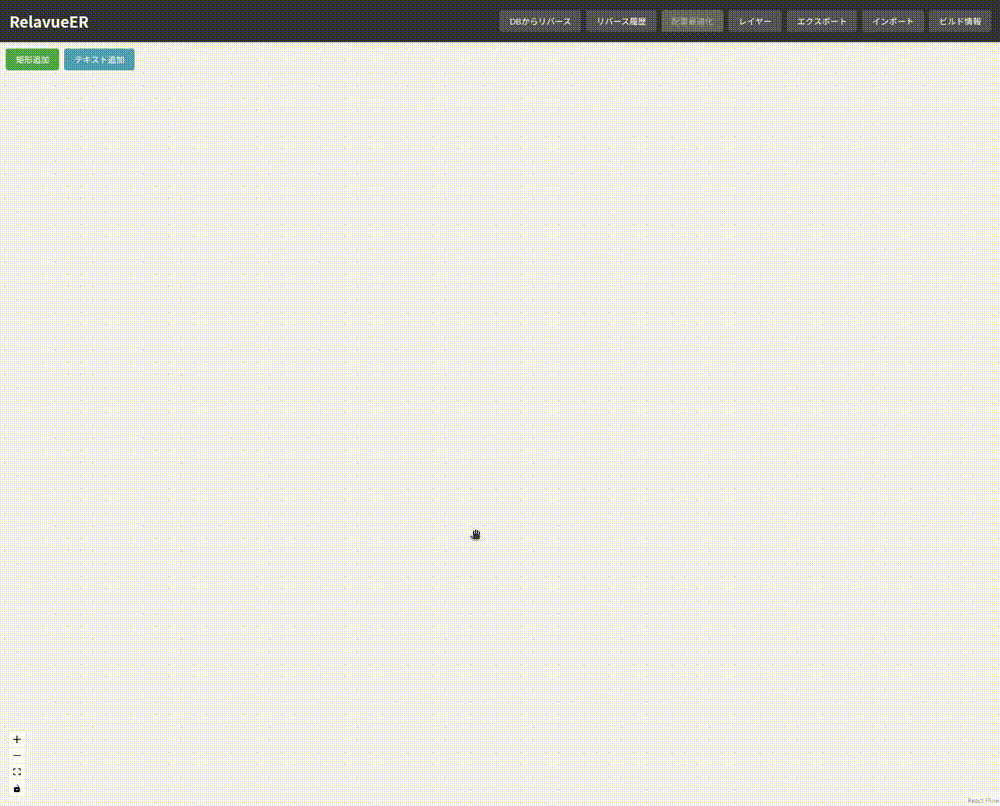
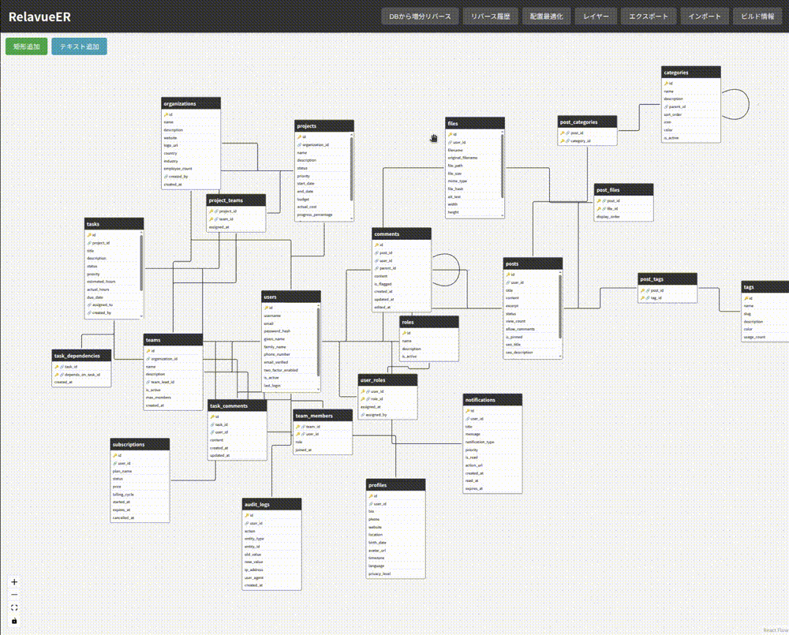
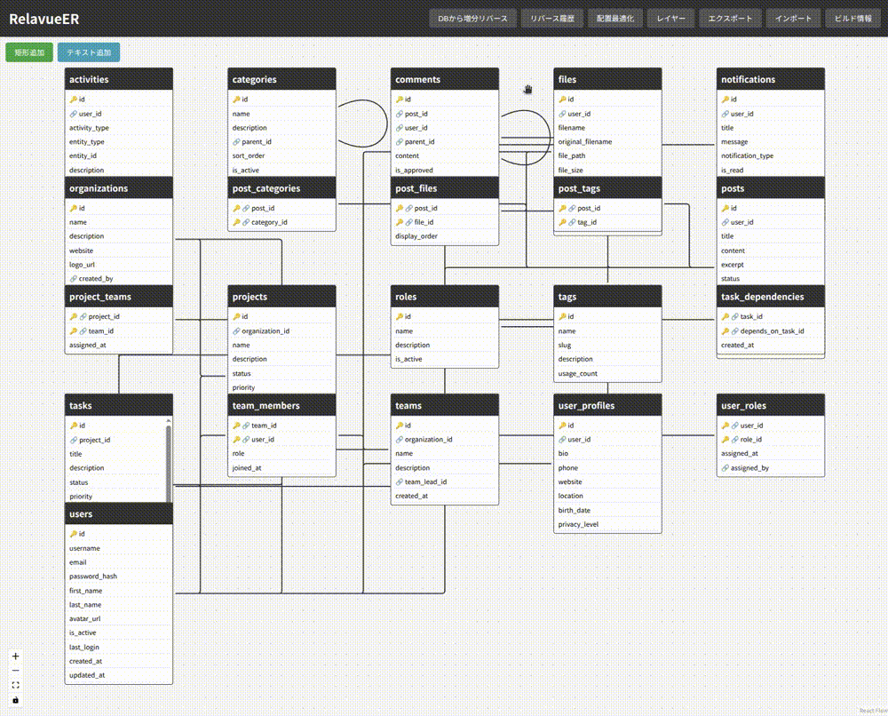
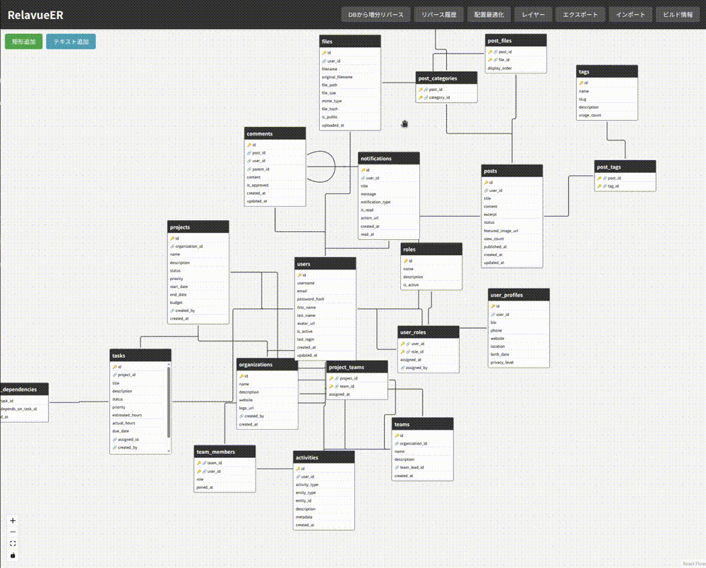
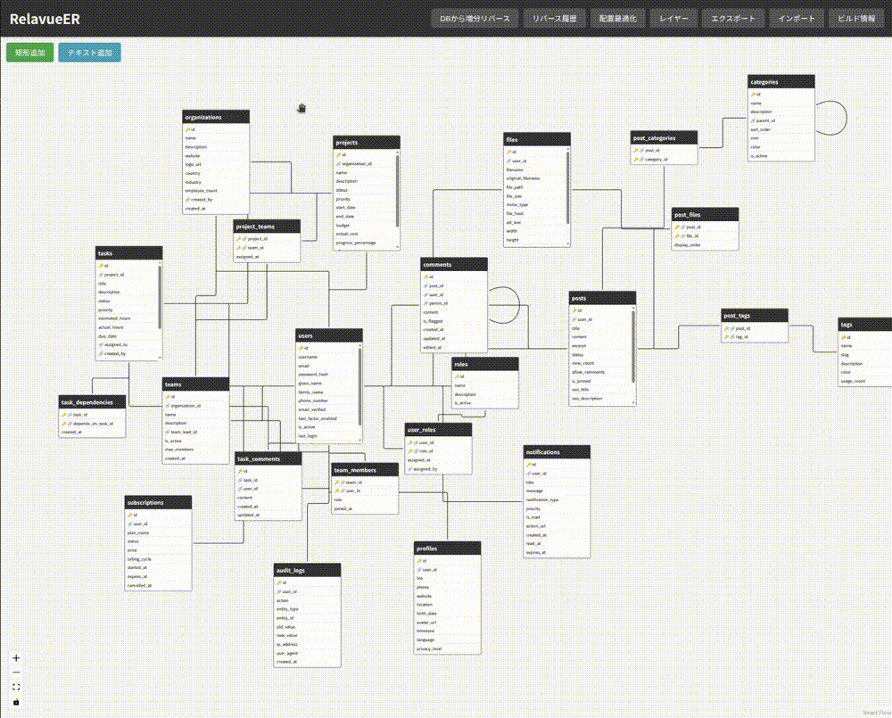
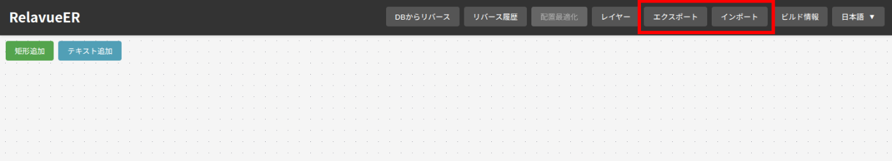

lang: [EN](README.md) | [JA](README_JA.md)

# RelavueER

RelavueER is a tool that reverses ER diagrams from databases and allows you to view them interactively in your browser with ease.



### 🟠 Concept

* Ready to use
* Display-focused, interactive, and easy to view

### 🟠 Supported Databases

* MySQL
* PostgreSQL

### 🟠 Limitations

* Not designed to be integrated into CI pipelines
* Requires foreign keys to be defined in the database

## 🟦 Usage

### 🟠 For macOS / Windows (Docker Desktop)

1\. Start the container

```bash
docker run --pull=always --rm -p 30033:30033 tkuni83/relavue-er
```

2\. Access [http://localhost:30033](http://localhost:30033)

3\. Click the "Reverse from DB" button, enter your database connection information, and execute

**⚠️ Note**: To connect from the Docker container, use `host.docker.internal` instead of `localhost` for the Host.


<p align="center">
  
</p>


### 🟠 For Linux

1\. Start the container

```bash
docker run --pull=always --rm --network host tkuni83/relavue-er
```

2\. Access [http://localhost:30033](http://localhost:30033)

3\. Click the "Reverse from DB" button, enter your database connection information, and execute


<p align="center">
  
</p>

## 🟦 Features

### 🟠 Reverse Engineering from Database

Connect to your database and generate ER diagrams.



### 🟠 Highlight Feature

When you hover over an entity, related tables are highlighted.
The same applies when hovering over foreign key columns.



### 🟠 Layout Optimization

Optimize entity placement by positioning related tables close to each other.



### 🟠 Incremental Reverse Engineering

Supports incremental reverse engineering when database changes are made.
You can reverse while maintaining the existing ER diagram layout.

You can also view the differences.



### 🟠 Add Notes

You can add memos and notes for reference.



### 🟠 Save and Load

Save and load ER diagrams using "Export" and "Import".
You can save with Ctrl + S, or drop a saved JSON file onto the screen to load it.




## 🟦 For Developers

See [README_DEVELOP.md](README_DEVELOP.md)
